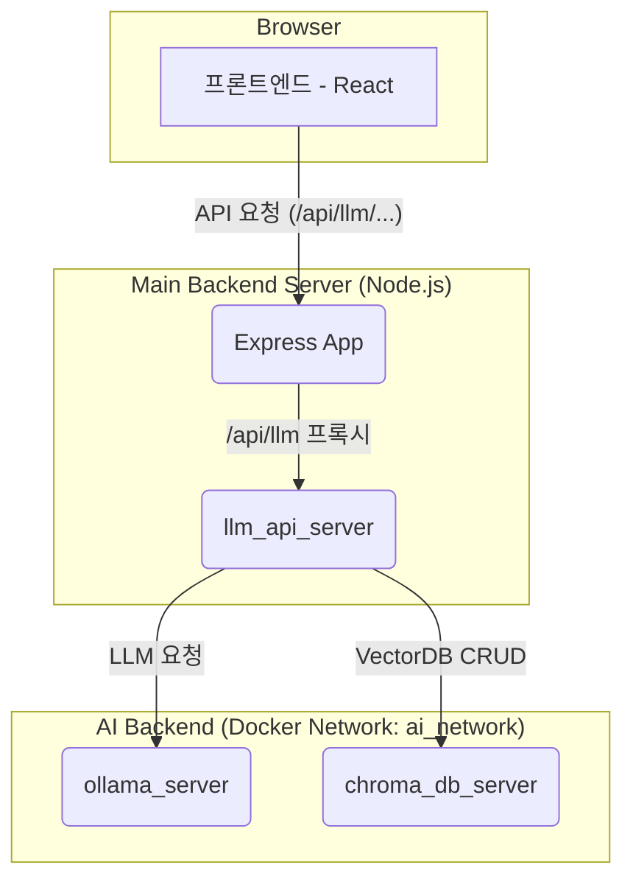

# BlankSpace 쇼핑몰 AI 비서 백엔드 시스템

이 문서는 BlankSpace 쇼핑몰에 탑재된 대화형 AI 비서의 백엔드 시스템에 대한 아키텍처, 설정 방법, 그리고 개발 과정에서 발생했던 주요 문제와 해결 과정을 기록합니다.

## 1. 시스템 개요

### 1.1. 프로젝트 목표
사용자에게 개인화된 상품 추천 경험을 제공하기 위해, 자연어 대화를 통해 상품을 검색하고 관련 정보를 얻을 수 있는 대화형 AI 추천 시스템을 구축합니다.

### 1.2. 주요 기능
- **자연어 대화**: 사용자의 의도를 파악하여 관련된 답변 생성.
- **음성 대화**: STT(Speech-to-Text) 및 TTS(Text-to-Speech)를 통한 음성 인터페이스 제공.
- **상품 정보 기반 답변 (RAG)**: ChromaDB에 저장된 상품 정보를 바탕으로, 실제 판매 상품에 대한 질문에 답변하고 추천.
- **LLM**: Ollama를 통해 로컬 환경에서 `gemma3:12b-it-qat` 모델을 서빙하여 대화 생성.

---

## 2. 기술 스택 및 아키텍처

### 2.1. 서비스 구성도


### 2.2. 컴포넌트 별 역할
- **`main_backend` (Node.js/Express)**
  - 기존 쇼핑몰의 백엔드 로직을 담당합니다.
  - 프론트엔드와 AI 백엔드 사이의 **프록시 서버** 역할을 수행합니다. 모든 AI 관련 요청 (`/api/llm`)을 `llm_api_server`로 전달합니다.

- **`llm_api_server` (Python/FastAPI)**
  - **AI 로직의 핵심 컨트롤 타워**입니다.
  - RAG, STT, TTS 등 모든 AI 관련 처리를 수행하는 API 엔드포인트를 제공합니다.
  - `Ollama`에 추론을 요청하고 `ChromaDB`에서 관련 정보를 검색하여 최종 답변을 생성합니다.

- **`ollama_server` (Ollama)**
  - `gemma3:12b-it-qat` 언어 모델을 로드하고 서빙하는 로컬 LLM 서버입니다.
  - GPU 가속을 통해 효율적인 추론을 수행합니다.

- **`chroma_db_server` (ChromaDB)**
  - 상품 이름, 설명, 가격 등 텍스트 정보를 벡터(Vector)로 변환하여 저장하는 벡터 데이터베이스입니다.
  - RAG 파이프라인에서 사용자의 질문과 가장 유사한 상품 정보를 빠르게 찾는 역할을 합니다.

---

## 3. 설치 및 실행 방법

### 3.1. 요구사항
- **Docker & Docker Compose**: 컨테이너 기반의 서비스들을 관리하고 실행하기 위해 필수적입니다.
- **NVIDIA GPU & CUDA Driver**: `ollama`의 LLM 추론 가속을 위해 GPU 환경이 권장됩니다.

### 3.2. 환경 변수 설정
실행 전, `backend/llm_server/` 경로에 `.env` 파일을 생성하고 아래 내용을 입력해야 합니다. 이 파일은 각 AI 서비스 컨테이너의 주소를 지정합니다.

**파일명: `backend/llm_server/.env`**
```env
# ChromaDB 벡터 데이터베이스 서버 정보
# (docker-compose.yml에 정의된 컨테이너 이름)
CHROMA_DB_HOST=chroma_db_server
CHROMA_DB_PORT=8000

# Ollama LLM 서버 정보
# (docker-compose.yml에 정의된 컨테이너 이름)
OLLAMA_HOST=ollama_server
OLLAMA_PORT=11434

# 사용할 LLM 모델 이름
OLLAMA_MODEL=gemma3:12b-it-qat
```

### 3.3. 실행 명령어
프로젝트의 `backend` 폴더에서 아래 명령어들을 순서대로 실행합니다.

1.  **모든 컨테이너 중지 및 이전 볼륨 제거 (클린 시작)**
    ```shell
    docker-compose down
    ```

2.  **이미지 재빌드 및 백그라운드 실행 (가장 중요)**
    - `--build` 옵션은 `Dockerfile`이나 파이썬 코드 등 소스 코드 변경사항을 이미지에 새로 반영하기 위해 필수적입니다.
    ```shell
    docker-compose up -d --build
    ```

### 3.4. 상태 확인
- **실행 중인 컨테이너 확인:**
  ```shell
  docker ps
  ```
- **특정 컨테이너의 로그 확인 (오류 발생 시):**
  ```shell
  docker logs [컨테이너 이름] 
  # 예: docker logs llm_api_server
  ```

---

## 4. 주요 트러블슈팅 기록

이 시스템을 구축하며 겪었던 주요 문제와 최종 해결책을 기록합니다.

### 문제 1: 프론트엔드 ↔ AI 서버 통신 완전 불가
- **증상**: AI 채팅 요청 시 아무런 응답이 없었으며, 메인 백엔드와 AI 서버 양쪽 모두에 관련 로그가 전혀 남지 않았습니다.
- **분석 과정**:
  1. 메인 백엔드의 프록시(`llm.api.js`)에 로그를 추가했지만, 로그가 찍히지 않아 요청이 도달조차 못 함을 확인.
  2. 프론트엔드(`package.json`)에 API 서버 주소를 지정하는 `proxy` 설정이 누락된 것을 발견.
  3. 프록시 설정 추가 후, `react-scripts`의 웹팩 개발 서버에서 `allowedHosts` 관련 오류 발생. (`webpackDevServer.config.js` 수정으로 해결)
  4. 이후 `curl`로는 AI 서버에 직접 요청이 성공했으나, 유독 Node.js 프록시를 통한 요청만 멈추는 현상 발생.
  5. **최종 원인**: Node.js v17부터 `localhost`를 해석할 때 IPv6(`::1`)를 IPv4(`127.0.0.1`)보다 우선시하는 DNS 해석 정책 변경이 원인이었습니다. Docker 서버는 IPv4로만 리스닝하고 있어 연결이 교착 상태에 빠졌습니다.
- **최종 해결책**: `http-proxy-middleware`가 이 문제를 해결하지 못해, **Node.js의 내장 `fetch`를 사용한 수동 프록시 코드로 `llm.api.js`를 완전히 교체**하여 문제를 해결했습니다.

### 문제 2: AI 서버 초기화 실패 (ChromaDB 연결)
- **증상**: `llm_api_server` 로그에 `Could not connect to tenant default_tenant` 오류가 반복적으로 발생하며 서버가 완전히 켜지지 않았습니다.
- **원인**: **서비스 시작 순서 경쟁 상태 (Race Condition)**. `docker-compose.yml`의 `depends_on: service_started` 옵션은 컨테이너가 켜졌는지 여부만 확인할 뿐, 내부 서비스가 완전히 준비될 때까지 기다려주지 않습니다. `llm_api_server`가 `chroma_db_server`의 내부 데이터베이스 준비가 완료되기 전에 접속을 시도하여 발생한 문제입니다.
- **해결책**: `docker-compose.yml`에 **`healthcheck` 기능**을 도입했습니다.
  - `chromadb` 서비스에 `/api/v1/heartbeat` 엔드포인트를 주기적으로 체크하는 `healthcheck`를 추가.
  - `llm_api_server`의 `depends_on` 조건을 `condition: service_started`에서 `condition: service_healthy`로 변경하여, ChromaDB가 완벽히 준비될 때까지 기다리도록 수정.

### 문제 3: AI 서버 모듈 로딩 중 멈춤 및 오류
- **증상**: 서버가 시작되는 과정에서 특정 모델을 로드하다가 멈추거나, 관련 오류를 내며 비정상적으로 작동했습니다.
- **원인 및 해결책**:
  - **멈춤 현상**: `SentenceTransformer` 임베딩 모델을 Hugging Face에서 다운로드하는 과정에서 컨테이너 네트워크 문제로 멈췄습니다.
    - **해결**: `Dockerfile`에 `RUN mkdir -p /root/.cache/torch/hub/` 명령어를 추가하여 모델 캐시 폴더를 미리 생성하고 권한 문제를 예방했습니다.
  - **TTS 오류**: `piper-tts`가 모델 설정 파일(`.json`)을 찾지 못하는 `No such file or directory` 오류가 발생.
    - **해결**: `llm_service.py`의 `PiperVoice.load()` 함수 호출 시, 모델이 저장될 디렉터리를 `data_path` 인자로 명시적으로 지정하여 경로 문제를 해결했습니다.
  - **RAG 검색 오류**: `You must provide an embedding function` 오류 발생.
    - **해결**: 문제 진단을 위해 임시로 비활성화했던 `SentenceTransformerEmbeddings`를 다시 활성화하고, `Chroma` 클래스를 생성할 때 `embedding_function` 인자를 명시적으로 전달하도록 `rag_module.py` 코드를 복구하여 해결했습니다.

### 문제 4: `embedding_pipeline.py` 실행 시 MongoDB 타임아웃
- **증상**: `embedding_pipeline.py` 스크립트 실행 시, MongoDB에 연결하는 과정에서 `NetworkTimeout` 오류가 발생하며 데이터를 가져오지 못했습니다.
- **원인**: **리소스 경합(Resource Contention)**. 스크립트가 시작되자마자 I/O 작업(MongoDB 데이터 조회)과 CPU/GPU 집약적 작업(무거운 AI 임베딩 모델 로드)이 동시에 실행되었습니다. 모델을 메모리에 올리는 작업이 CPU 자원을 독점하여, `pymongo` 드라이버가 네트워크 응답을 제시간에 처리하지 못해 타임아웃이 발생한 것입니다.
- **해결책**: **작업 순서 강제(지연 로딩)**. `embedding_pipeline.py`의 구조를 변경하여, **(1) 먼저 MongoDB에서 모든 데이터를 가져와 메모리에 저장하고 연결을 즉시 끊은 뒤, (2) 그 후에야 AI 관련 모듈(`rag_module`, `Chroma`)을 임포트하고 모델을 로드**하도록 수정했습니다. 이로써 네트워크 I/O 작업과 CPU 집약적 작업을 완전히 분리하여 리소스 경합을 원천적으로 방지했습니다. 

### 문제 5: TTS(Text-to-Speech) 서비스 500 오류
- **증상**: AI 비서의 텍스트 응답은 정상적으로 작동하지만, 음성 변환(TTS) 요청 시 500 내부 서버 오류가 발생했습니다.
- **원인**: 
  1. **모델 로딩 문제**: `your_tts` 다국어 모델이 GPU 메모리 부족 또는 호환성 문제로 제대로 로드되지 않았습니다.
  2. **예외 처리 미흡**: TTS 모델 로드 실패 시 적절한 대체 모델을 시도하지 않고, 오류 처리가 불완전했습니다.
  3. **파라미터 호환성**: 모델마다 지원하는 파라미터가 다른데, 이를 고려하지 않은 코드 구조였습니다.
- **해결책**:
  1. **모델 로딩 개선**: 
     - GPU 모드 대신 CPU 모드로 먼저 시도하도록 수정
     - 기본 모델(`your_tts`) 로드 실패 시 한국어 전용 대체 모델(`tts_models/ko/glowtts/kokoro`)을 시도하도록 폴백 메커니즘 추가
  2. **오류 처리 강화**:
     - 모든 예외 상황에서 적절한 HTTP 응답을 반환하도록 개선
     - 빈 텍스트 입력 검증 로직 추가
  3. **모델별 파라미터 분기 처리**:
     - 모델 유형에 따라 적절한 파라미터(`speaker`, `language` 등)를 사용하도록 분기 처리
     - `TypeError` 예외 처리를 통해 지원하지 않는 파라미터 호출 시에도 기본 기능이 작동하도록 개선

이러한 변경으로 TTS 서비스의 안정성이 크게 향상되었고, 다양한 오류 상황에서도 적절한 응답을 제공하도록 개선되었습니다. 